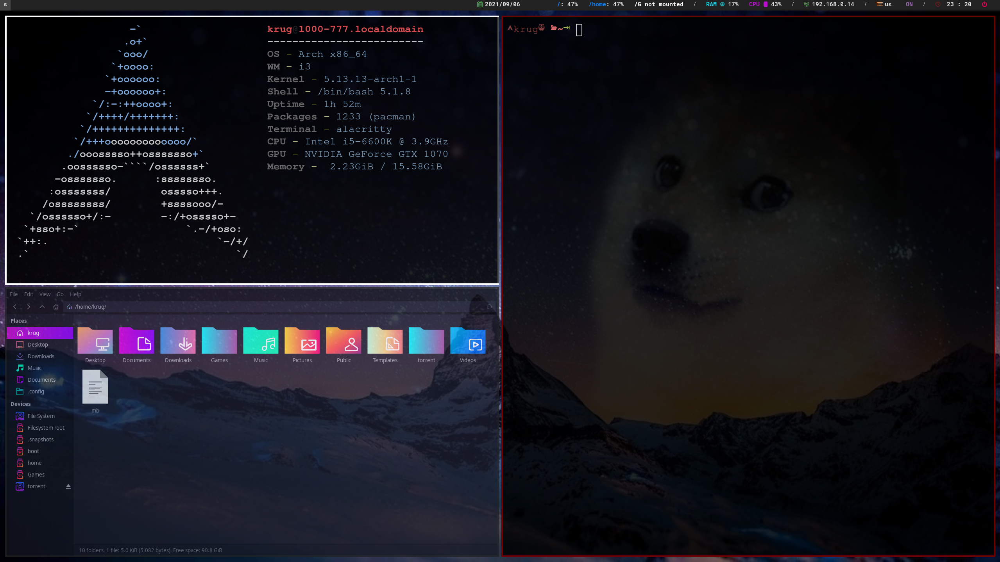

# i3 Multi monitor setup with polybar

## Monitor 1 - Primary

## Monitro 2

## Monitor 3 

### Lockscreen

### Rofi

### Rofi powermenu (author Aditya Shakya https://github.com/adi1090x)

### Essential programs
picom 

alacritty

[colorls](https://github.com/athityakumar/colorls)
* ruby 

[i3blocks](https://github.com/vivien/i3blocks)

moc - music player

htop

ranger / mc

scrot [aur](https://aur.archlinux.org/packages/scotch/)

ImageMagick

thunar / nautilus

xorg-xrandr

feh

flameshot

lxappearance

ktorrent

virtualbox 

sounux

[fluent reader](https://aur.archlinux.org/packages/fluent-reader/)

### Fonts 
* [Nerd fonts](https://github.com/ryanoasis/nerd-fonts)

* siji - [aur](https://github.com/stark/siji)

* Font awesome - [aur](https://archlinux.org/packages/community/any/ttf-font-awesome/)

* xorg-fonts

### Theming
* Main theme: 
  * [Sweet](https://www.opendesktop.org/s/Gnome/p/1253385/)
  * [Dracula](https://www.opendesktop.org/s/Gnome/p/1253385/)

* Icons:
  * [Candy](https://www.gnome-look.org/p/1305251/)
  * [Sweet folders](https://www.gnome-look.org/p/1284047)
  * [Red-Dot-Black-Dark-Icons](https://www.gnome-look.org/p/1473369)
  * [Infinity-Dark-Icons](https://www.gnome-look.org/p/1436570)
  
* Cursor - [Lyra:](https://github.com/yeyushengfan258/Lyra-Cursors)
  * [&:Y](https://www.gnome-look.org/p/1543937)
  * [&:S](https://www.gnome-look.org/p/1530387)
  * [&:F](https://www.gnome-look.org/p/1514940)
  * [&:Q](https://www.gnome-look.org/p/1518883)
  * [&:R](https://www.gnome-look.org/p/1502737)
  * [&:G](https://www.gnome-look.org/p/1507256)

* [Grub - vimix ](https://github.com/vinceliuice/grub2-themes)
* [SDDM - Aerial](https://github.com/3ximus/aerial-sddm-theme)
* [rofi - Dracula](https://draculatheme.com/rofi)

#### Fixes of some issues
[Polybar cursor](https://www.reddit.com/r/Polybar/comments/fv1c2f/polybar_using_default_x_cursor/)

[ds screenshare](https://www.reddit.com/r/discordapp/comments/f22vz6/guide_how_to_stream_audio_to_discord_on_linux/)

[multimonitor configuration with xorg](https://www.x.org/releases/current/doc/man/man5/xorg.conf.5.xhtml#heading14) [archwiki](https://wiki.archlinux.org/title/Multihead) - [archwiki multihead](https://wiki.archlinux.org/title/Multihead)
